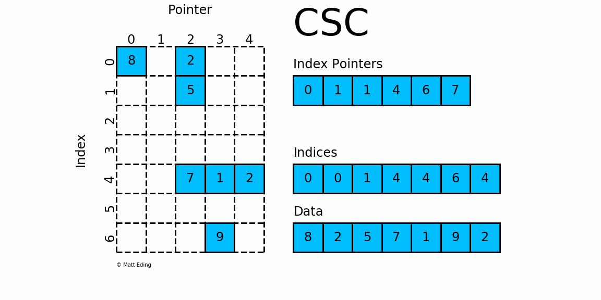

# SparseMatrix
使用 C++ 实现对稀疏矩阵的相关操作。

# COO
COO 的数据存储图  
  
COO 动图展示  
  

# CSR
CSR 的数据存储图  
  
CSR 动图展示  
  

# CSC
CSC 的数据存储图  
  
CSC 动图展示  
  

# 目录结构
├── LICENSE  
├── Makefile  
├── README.md  
├── build                           可执行文件保存目录  
├── libs                            库文件保存目录  
├── src                             自己实现的CPP文件保存目录，目前H文件也暂时放这里  
│   ├── CSRMatrix.h  
│   └── SparseMatrix.h  
└── test                            测试用代码  
    └── CSRTest.cpp  

# 类说明
SparseMatrix 类  
    一个纯虚类。基类。  
  
CSRMatrix 类  
    继承自 SparseMatrix，实现 CSR 的稀疏矩阵  

# 当前进度
目前只是实现了一个纯虚类，实现了基础的代码。

# 使用方法
## 开发环境
Ubuntu 18.04  
g++    7.5.0  
## 编译方法
make all  
## 运行方法
./build/main  